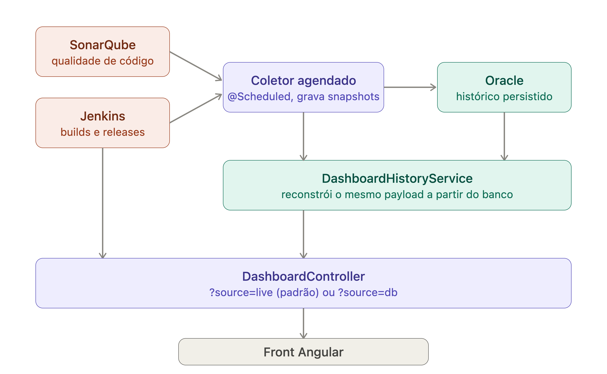

# Engineering Analytics — Visão Geral

Projeto com **Angular 18** (frontend) e **Spring Boot 3** (backend) que replica a tela
"Visão Geral" e busca os dados reais do **SonarQube** e **Jenkins**.

## Arquitetura




## Estrutura

```
engineering-analytics/
├── backend/    Spring Boot (Java 17) — agrega dados do Sonar e Jenkins
└── frontend/   Angular 18 (standalone) — tela do dashboard
```

## Rodando com mock do Sonar (sem precisar de instância real)

O projeto inclui um mock do SonarQube em `mock-sonar/sonar_mock_server.py` (só usa a
stdlib do Python, zero dependências). Ele gera 148 projetos fake batendo com os números
do dashboard de exemplo (12,8M linhas, 82,4% cobertura, 23 vulnerabilidades, 47 issues
críticas) e responde nos mesmos formatos que o `SonarClient.java` já consome:

- `GET /api/projects/search`
- `GET /api/measures/component`
- `GET /api/issues/search`
- `GET /api/measures/search_history`

1. Suba o mock:

   ```bash
   cd mock-sonar
   python3 sonar_mock_server.py 9001
   ```

2. Rode o backend com o profile `mock` (já aponta `sonar.url` para `http://localhost:9001`):

   ```bash
   cd backend
   ./mvnw spring-boot:run -Dspring-boot.run.profiles=mock
   ```

   O Jenkins continua precisando de configuração real (ou você pode criar um mock
   parecido para ele, seguindo o mesmo padrão — é só pedir).

3. `GET http://localhost:8080/api/dashboard/overview` já deve devolver dados
   consistentes vindos do mock.

## Backend

1. Configure as credenciais em `backend/src/main/resources/application.yml`
   (ou via variáveis de ambiente `SONAR_TOKEN`, `JENKINS_USER`, `JENKINS_API_TOKEN`):

   ```yaml
   integrations:
     sonar:
       url: https://sonar.suaempresa.com
       token: ${SONAR_TOKEN}
     jenkins:
       url: https://jenkins.suaempresa.com
       user: ${JENKINS_USER}
       api-token: ${JENKINS_API_TOKEN}
   ```

2. Rodar:

   ```bash
   cd backend
   ./mvnw spring-boot:run
   ```

   API disponível em `http://localhost:8080`.

### Endpoints

| Método | Rota | Descrição |
|---|---|---|
| GET | `/api/dashboard/overview` | Payload completo da tela (KPIs, gráficos, tabela, rodapé) |
| GET | `/api/dashboard/lines-evolution?projectKey=X&from=2024-06-01` | Série histórica de linhas de código |

Os dados são cacheados por 2 minutos (Caffeine) para não sobrecarregar Sonar/Jenkins.

## Frontend

```bash
cd frontend
npm install
npm start
```

Acesse `http://localhost:4200`. A URL da API é configurada em
`frontend/src/environments/environment.ts` (`apiUrl`).

## Pontos de atenção / próximos passos

- O gráfico "Evolução das linhas de código" precisa de um `projectKey` de referência
  (ou agregação própria) — hoje o endpoint `/lines-evolution` está separado do `/overview`
  para você escolher o projeto/portfólio certo.
- O token do Sonar precisa de permissão de leitura em **Browse** e **Execute Analysis**
  nos projetos; o token do Jenkins precisa de permissão de leitura nos jobs.
- Ajuste o `integrations.jenkins.view` caso queira restringir a uma pasta/view específica.
- CORS já libera `http://localhost:4200`; altere `integrations.allowed-origin` em produção.
